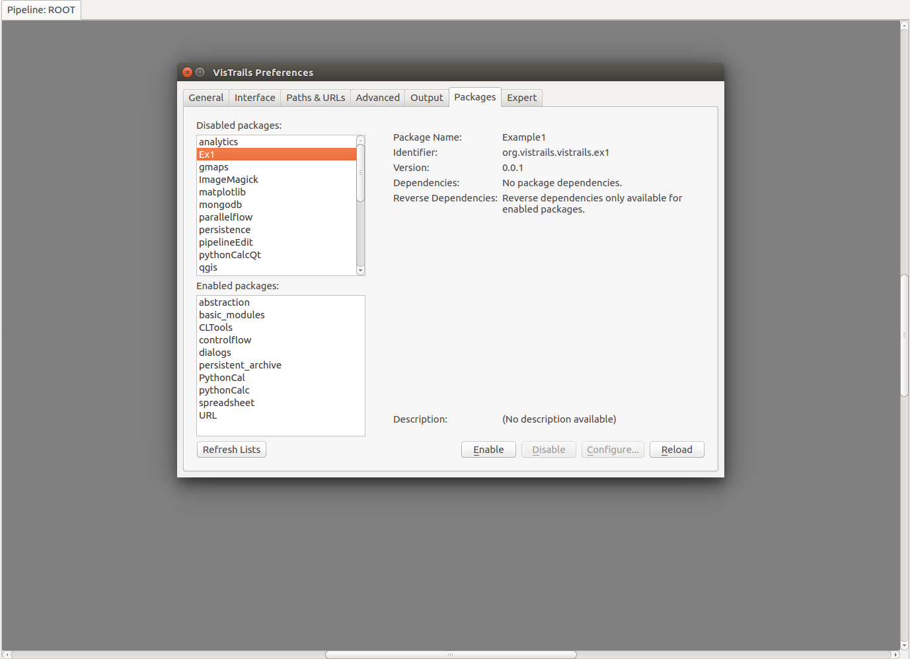

# Tutorial : How to install and use vistrails.

### Step 1 - Installing Vistrails

The easiest way to install is by simple installing conda and typing 
" **conda install -c vida-nyu vistrails** " in terminal and you will get the latest version of vistrails.


* For more details of installing conda see : https://conda.io/docs/user-guide/install/linux.html

### Step 2 - Using Vistrails

When we start it we should see vistrails like this :


Its modules are here:


They are responsible for building our application.

So giving an example how it works, we will build a logistic regression to classify the iris dataset.
First we need the module of iris dataset, to find it we can type in the search box of the modules:


Then we can drag "iris" and drop in the gray space, it will show a box named iris as you see bellow:


At the botton-right of the module it will have 2 circles, they are the output of the module. The first circle is the space for the data of iris and the most right circle is the label of the data.


In the next module we will split the data in train and test, here at the top-left of the module it will have 2 circles and a square, the first circle is the space for the data and the most right circle is the label of the data, the square is for parameters, those are inputs for the module.


Now we can connect the modules by clicking the circles and dragging to the destination, doing this it will be like :


Adding more modules to complete our task it is going to be this : (the diamond is for trained models)


Then we click on Execute and the output of the score ( accuracy by default ) will appear in the console :


Here in history is where you can see our step-by-step that we have done to build our application, 
we can see the changes and use a previous version our model :


Here in provenance in the top-right at log details we can see if a module got an error or succeeded in its task.


## Creating your own module

The Vistrails’ modules are basically python modules that inherit from Module -  class defined at vistrails.core. Hence to create your own module, Vistrails demand a specific structure to integrate it on the application. 

The basic structure of modules consists of two files inside the Directory named properly by the package name. 
    __init__.py - Contains the package’s metadata
    init.py 		- Contains the definition of the Modules’ classes

This directory may contain also auxiliary python modules that complements the package.

The __init__.py consists of the declaration of three basic 
    identifier
    name
    version
    
* e.g.:__init__.py 
    //sof 
    identifier = 'org.vistrails.vistrails.teste'
    name = 'Teste'
    version = '0.0.1'
    // eof

The init.py consists of the Class declaration, the attributes _input_ports e _output_ports and the methor compute() that is mainly executed by Vistrails. Other methods can be add but this one is mandatory. The lists are described below:
    _input_ports 	- Receives a list from the IPort function defined at vistrails.core.modules.config, whose parameter follows the pattern (name=, signature=). Name refers to a string that identify the input parameter of the module, and signature, the datatype.
    _output_ports 	- Receives a list from the OPort function.

* e.g.:init.py
  first import vistrais modules to properly configure
```
    from vistrails.core.modules.vistrails_module import Module
    from vistrails.core.modules.config import IPort, OPort
```
  vistrails requires an initialization

    def __init__(self):
      Module.__init__(self)

  Your module must inherit from the class Module, imported above. After that, the initialization of the attributes follow the IPort definition.

    class Soma(Module):
      _input_ports = [IPort(name = "n1", signature = "basic:Float"),
        IPort(name = 'n2', signature = "basic:Float")]
      _output_ports = [OPort(name = "value", signature = "basic:Float")]

  The method compute() as follows:

    def compute(self):
        v1  = self.get_input("n1")
        v2 = self.get_input("n2")

        self.set_output("value", self.sum(v1,v2))

  Besides that, it may be necessary or preferable to use other functions

    def sum(self, v1, v2):
        return v1 + v2;


  Finally, it is necessary to specify which modules are defined for this package. So, it is used another variable defined by Vistrails.

    _modules = [Soma,]

###Setting up VIstrails
Once the files are ready, the final step is to import the package to the application. Go to Edit-> Preferences and then to the Packages tab.
The package named by the directory should appear at the Disabled list (if not, try to relaunch Vistrails). Then, enable de package and it will appear at the Packages list. 



```python

```
