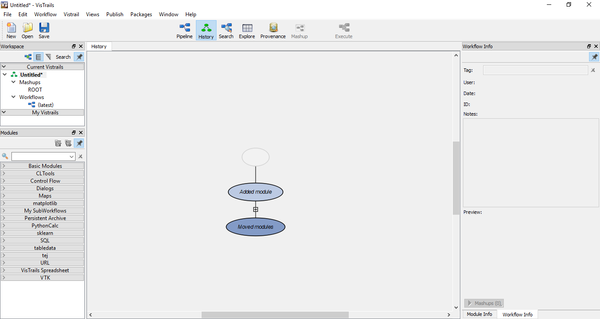

# Tutorial : How to install and use vistrails.

### Step 1 - Installing Vistrails

The easiest way to install is by simple installing conda and typing 
** conda install -c vida-nyu vistrails  ** in terminal and you will get the latest version of vistrails.


* For more details of installing conda see : https://conda.io/docs/user-guide/install/linux.html

### Step 2 - Using Vistrails

When we start it we should see vistrails like this :


Its modules are here:


They are responsible for building our application.

So giving an example how it works, we will build a logistic regression to classify the iris dataset.
First we need the module of iris dataset, to find it we can type in the search box of the modules:


Then we can drag "iris" and drop in the gray space, it will show a box named iris as you see bellow:


At the botton-right of the module it will have 2 circles, they are the output of the module. The first circle is the space for the data of iris and the most right circle is the label of the data.


In the next module we will split the data in train and test, here at the top-left of the module it will have 2 circles and a square, the first circle is the space for the data and the most right circle is the label of the data, the square is for parameters, those are inputs for the module.


Now we can connect the modules by clicking the circles and dragging to the destination, doing this it will be like :


Adding more modules to complete our task it is going to be this : (the diamond is for trained models)


Then we click on Execute and the output of the score ( accuracy by default ) will appear in the console :


Here in history is where you can see our step-by-step that we have done to build our application, 
we can see the changes and use a previous version our model :



Here in provenance in the top-right at log details we can see if a module got an error or succeeded in its task.


```python

```
